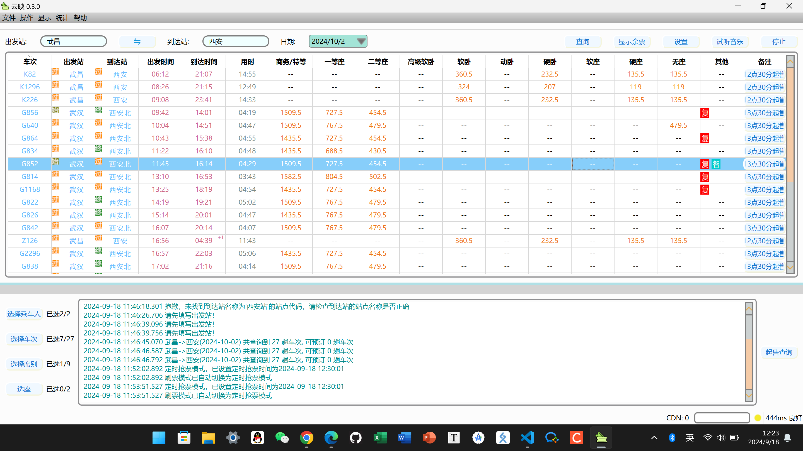

### ⚠️将该仓库clone到你的本地文件或下载release中的zip文件
### ⚠️双击yuny.exe运行即可
### ⚠️若更新系统时间失败，以管理员身份运行
-----------------
### 1.登录12306账号(账号密码/扫码)
### 2.点击设置按钮设置好是否候补/定时抢票/通知方式等
### 3.填写出发站/到达站/乘车日期，点击查询选择对应的车次，再选择乘车人/席别后点击开始

